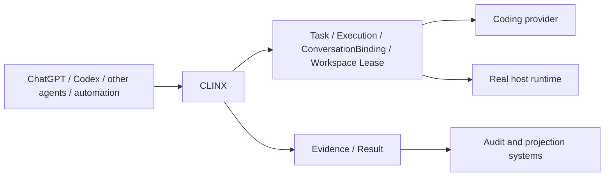

# CLINX

CLINX is the coordination and state layer for AI software engineering: an
engineering control plane for autonomous coding agents.

Coding agents are responsible for reasoning and coding. CLINX is responsible
for the durable engineering system around them:

`Identity + State + Coordination + Execution + Evidence`

It turns a one-off coding-agent interaction into work that can be continued,
recovered, coordinated, and audited without copying a long prompt between
sessions.



CLINX is not a foundation model, a coding-agent replacement, a generic remote
shell, or a Linear wrapper. Linear is an audit and notification projection;
it is not the command plane.

## Why CLINX exists

Agent sessions are useful but naturally ephemeral. Engineering work is not.
The same task may need multiple provider sessions, several agents, a guarded
workspace, real host operations, and an evidence-backed result. CLINX keeps
that work coherent while allowing the execution carrier to change.

- A **Task** is the long-lived engineering identity.
- A provider **thread/session/turn** is a replaceable execution carrier.
- **ConversationBinding** records which verified provider conversation is bound
  to the task, including historical adoption and migration lineage.
- A workspace **lease** enforces single-writer coordination and supports stale
  lease recovery.
- An **Execution** owns one bounded attempt, its exact route, evidence, result,
  and terminal lifecycle.
- The **Execution Finalizer** is the authoritative terminal decision maker;
  provider events and host evidence are inputs, not competing owners.

## Current capabilities

The checked-in implementation and test suite currently cover:

- Direct managed Codex app-server execution through the CLINX dispatcher.
- Durable Task and opaque Execution identities with exact task, turn, route,
  and lease ownership.
- ConversationBinding, bounded historical conversation adoption, and
  provider-thread migration with predecessor/successor lineage.
- Worktree single-writer leases, stale-lease reclamation, cancellation, and
  fail-closed routing checks.
- A bounded host executor for approved development operations, including the
  `clinx` dynamic namespace and `clinx_host_operation` tool.
- Provider terminal/failure reconciliation, exact host evidence, strict
  result parsing, and finalization that releases the execution lease.
- Idempotent result attribution and Linear audit binding without allowing
  Linear to own execution state.
- A safe MCP command plane with explicit approval and opaque execution
  references; the normal public catalog does not expose a generic `clinx_execute`.

These are self-hosted and dogfooded capabilities, not a claim of production
readiness. Runtime/provider behavior must still be qualified in the deployment
environment rather than inferred from unit tests alone.

## Core model

```text
Task (long-lived identity)
  ├── ConversationBinding (verified provider conversation)
  ├── Execution (one bounded attempt)
  │     ├── Workspace / worktree lease
  │     ├── Provider turn
  │     ├── Host execution evidence
  │     └── Execution result
  └── Linear task index (audit projection)
```

The lifecycle is intentionally split into authorities:

```text
provider event + host evidence
            ↓
      CLINX finalizer
            ↓
 durable result → terminal state → lease release → audit projection
```

Evidence outranks an agent claim. A provider thread that fails, times out, or
disconnects cannot silently become a successful execution; conflicting host
and provider evidence remains explicit. A missing provider result marker is
resolved only from exact execution evidence, never from a task's latest result
or another historical execution.

## Interoperability direction

CLINX is not tied to Codex. Codex is the current primary provider and adapter.
The long-term direction is a stable CLINX core with adapters for ChatGPT,
Claude Code, Cursor, OpenCode, CI/automation, and custom agents.

Different agents should coordinate around the same authoritative Task and
Execution state, rather than duplicating a conversation-sized prompt. Those
additional provider adapters and broader deployment integrations are roadmap
direction, not universal capabilities claimed by this repository today.

## Design principles

- Task identity outlives provider sessions.
- Evidence over agent claims.
- One writer per workspace.
- Explicit authority boundaries.
- Fail closed at external mutation boundaries.
- Keep the core small and stable; put integrations in adapters.
- Prefer real dogfood and runtime evidence over mock-only confidence.

## Getting started

Requirements: macOS or Linux, Python 3.11+, Git, a configured Codex
app-server/proxy transport, Linear MCP for the bridge workflow, and a Linear
personal API key. The repository has no required Python packages.

Start the bounded MCP adapter locally:

```bash
python3 mcp_server.py --config bridge.toml --stdio
```

For the existing pilot configuration, first run the repository doctor:

```bash
python3 bridge.py --config bridge.toml doctor
```

The bridge reads `LINEAR_API_KEY` from the process environment. Do not put the
key in this repository or in `bridge.toml`.

After the selected project identity and app-server transport are configured,
run one polling cycle:

```bash
python3 bridge.py --config bridge.toml once
```

Use the continuous loop only when the deployment is intentionally operated as
a local service:

```bash
python3 bridge.py --config bridge.toml run
```

Task discovery and context reads are bounded and do not start a provider turn.
Execution requires an explicit approved preparation/start flow; private thread,
session, turn, cwd, repository-origin, and credential values remain internal
registry data.

## Boundaries and status

CLINX currently supports local or explicitly configured SSH-stdio provider
transport. This repository does not itself publish an unauthenticated HTTP
endpoint. Remote discovery requires an authenticated, TLS-terminated MCP
boundary supplied by the deployment environment.

CLINX does not push, merge, deploy, grant Linear `Done`, or expose arbitrary
shell access. Host operations are bounded by registered project identity,
execution policy, capability, and approval checks.

Status: actively developed, self-hosted, and dogfooded. Production deployment,
provider interoperability beyond the current adapter, and broader autonomous
operation remain qualification and roadmap work.
