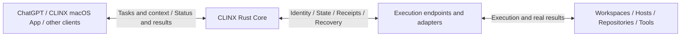

# CLINX

**Architecture:** Rust owns Authority, lifecycle, persistence/recovery,
MCP/Provider/Host/Transport, Node/Discovery, and current build/maintenance tools.
Swift owns the macOS UI. The remaining Python source, compatibility packages and
qualification runners have been retired; no Python layer is required by current source.

Start with [the architecture and layout](docs/REPOSITORY_ARCHITECTURE.md) and
[Python retirement evidence](docs/RUST_PYTHON_RETIREMENT.md).
`kernel/` contains Rust runtime, tools and tracked tests; `native/opaque_pairing/`
is the native OPAQUE core; `MonitorApp/` is Swift. `clinx/mcp/registry.json` is
shared protocol data, not a Python package. `fixtures/` holds independent frozen
oracles and original-to-native qualification mappings.

Source migration, candidate artifacts and deployed services are separate states.
This cleanup does not deploy new binaries or alter installed releases or runtime data.

**AI Task Routing & Execution Infrastructure**

**AI 任务路由与执行流通基础设施**

CLINX connects AI clients, coding agents and execution environments. It routes
tasks, instructions and context to the correct execution endpoint with low
latency, and reliably returns real execution status and results. Accurate
delivery, fast flow, reliable receipts and bidirectional communication are its
core mission. See the [product positioning and responsibility boundaries](docs/PRODUCT_POSITIONING.md).

CLINX owns task identity, routing, delivery correlation, idempotency and recovery.
Coding agents and their environments perform the business work; upstream and
downstream components own their business permissions, credentials and safety
policies. CLINX adds no separate approval or business-review layer.

For the current native Codex adapter, ordinary tasks use `NATIVE_FULL_ACCESS`
(`dangerFullAccess`, `approvalPolicy=never`), without writable-root lists or
network restrictions. See [native runtime configuration](docs/NATIVE_FULL_ACCESS.md).

The only execution configuration is optional `model` and `reasoning_effort`.
Use an exact Codex conversation URI directly: prepare once, then start, without
repeated searches, policy reviews or approval questions.

Task preparation forwards user work to native Codex. Git operation names,
capability lists, and repository targets are task context, not CLINX permission
checks. Codex and the target environment own operation access; CLINX owns task
routing, concurrent execution coordination, and execution records. See the
[task forwarding contract](docs/EXECUTION_AUTHORITY.md#native-task-forwarding-2026-10-17).

Start with the [documentation index](docs/README.md) for repository layout,
current contracts, dated release evidence and recovery boundaries, or the
[script and launcher index](scripts/README.md) for entrypoints and their effects.

It turns a one-off coding-agent interaction into work that can be continued,
recovered, coordinated, and audited without copying a long prompt between
sessions.


```mermaid
flowchart LR
  U[ChatGPT / CLINX macOS App / other clients]
  U <-->|Tasks and context / Status and results| C[CLINX Rust Core]
  C <-->|Identity / State / Receipts / Recovery| A[Execution endpoints and adapters]
  A <-->|Execution and real results| E[Workspaces / Hosts / Repositories / Tools]
```

Rust Core is the authoritative entrypoint for deployed P620 task state, receipts,
recovery and resource lifecycle. The source Helper now uses the paired Rust authority
route with independently read Mac Provider evidence; see [native core retirement](docs/RUST_NATIVE_CORE_RETIREMENT.md).
Normal MCP, native/Host execution, Node/Discovery, observation and monitoring
all run in Rust in current source. The Python caller facades have been retired.
Source structure, staged releases and deployed behavior require separate evidence.

CLINX is not another AI agent, a code-review platform, a safety-approval system
or a control center deciding what users may do. Linear is an optional audit and
notification projection; its availability must not block normal task flow.

## Why CLINX exists

Agent sessions are useful but naturally ephemeral. Engineering work is not.
The same task may need multiple provider sessions, several agents, a guarded
workspace, real host operations, and an evidence-backed result. CLINX keeps
that work coherent while allowing the execution carrier to change.

- A **Task** is the long-lived engineering identity.
- A provider **thread/session/turn** is a replaceable execution carrier.
- **ConversationBinding** records which verified provider conversation is bound
  to the task, including historical adoption and migration lineage.
- Rust execution **leases** fence attempts per task. Independent tasks can share
  a workspace; unknown delivery retains only the affected task's ownership.
- An **Execution** owns one bounded attempt, its exact route, evidence, result,
  and terminal lifecycle.
- **Execution finalization** commits terminal state through the same core
  authority; provider events and host evidence are inputs, not competing owners
  or a separate business-acceptance layer.

## Current capabilities

The checked-in implementation and test suite currently cover:

- Native Codex task creation and continuation through the configured Desktop
  daemon, with exact input receipts; see [Desktop execution](docs/DESKTOP_NATIVE_EXECUTION.md).
- Durable Task and opaque Execution identities with exact task, turn, route,
  and lease ownership.
- ConversationBinding, bounded historical conversation adoption, and
  provider-thread migration with predecessor/successor lineage.
- Per-task Rust leases, stale-lease reconciliation, cancellation, and
  fail-closed routing checks.
- Internal legacy Host execution and receipt reconciliation. Host capability
  tools are not part of the public native-forwarding catalog.
- Provider terminal/failure reconciliation, exact host evidence, strict
  result parsing, and finalization that releases the execution lease.
- Idempotent result attribution and Linear audit binding without allowing
  Linear to own execution state.
- An MCP prepare/start flow with opaque execution references. The user's task
  instruction supplies authorization; the normal public catalog does not expose
  a generic `clinx_execute`.
- Versioned execution contracts, runtime ownership and Rust qualification work.
  Source, isolated qualification and installed releases have separate evidence;
  see the [release record index](docs/README.md#发布与回退记录).

These are self-hosted and dogfooded capabilities, not a claim of production
readiness. Runtime/provider behavior must still be qualified in the deployment
environment rather than inferred from unit tests alone.

## Core model

```text
Task (long-lived identity)
  ├── ConversationBinding (verified provider conversation)
  ├── Execution (one bounded attempt)
  │     ├── Per-task execution lease
  │     ├── Provider turn
  │     ├── Host execution evidence
  │     └── Execution result
  └── Linear task index (audit projection)
```

Lifecycle stages share one task-state authority:

```text
provider event + host evidence
            ↓
  CLINX core finalization
            ↓
 durable result → terminal state → lease release → audit projection
```

CLINX reports the actual execution state and preserves conflicting or unknown
observations. A disconnect or lost ACK alone does not establish business failure
or permit replay. Result attribution uses the exact execution identity, never a
task's latest result or another historical execution. Delivery, execution,
receipt and result readback are distinct states; execution completion does not
establish business acceptance.

## Interoperability direction

CLINX is not tied to Codex. Codex is the current primary provider and adapter.
The long-term direction is a stable CLINX core with adapters for ChatGPT,
Claude Code, Cursor, OpenCode, CI/automation, and custom agents.

Different agents should coordinate around the same authoritative Task and
Execution state, rather than duplicating a conversation-sized prompt. Those
additional provider adapters and broader deployment integrations are roadmap
direction, not universal capabilities claimed by this repository today.

## Design principles

- Keep normal task flow short and free of unnecessary checks.
- Correlate task, session, execution and receipt identities accurately.
- Minimize latency, overhead and intermediate components.
- Recover the original execution through real state readback after lost ACKs,
  disconnects or restarts; avoid duplicate execution.
- Give each authoritative responsibility one implementation and reuse existing
  state, receipt and recovery mechanisms.

Measure delivery success and latency, correlation accuracy, recovery success,
duplicate execution or business submissions, competing state writers, and
adapter maintenance cost. Code volume, test count, approval layers and the
proportion of Rust files do not establish product quality.

## Nearby devices (Local Discovery v1)

The optional `bin/clinx` launcher opens `devices` by default through the native
`clinx-device` binary. It browses private
LAN nodes, shows persistent device trust, and authenticates known peers with
mutual TLS. Existing local/SSH provider and manual host paths remain available.

Production pairing uses the RFC 9807 OPAQUE core linked into Rust; it requires no
Python interpreter or wheel. The incompatible SPAKE2 development backend and
`--allow-dev-pairing` fallback are retired; device trust grants no execution
authority. See [Local Discovery v1](docs/LOCAL_DISCOVERY_V1.md) for native build
instructions, isolated setup, the two-device flow and the limits of recorded
acceptance.

The normal Observer service is `clinx-observer`; the standalone read-only MCP
entry is `clinx-mcp --observations-only --stdio`. Current runtime and development
boundaries, original assertion mappings and verification limits are recorded in
[the native source retirement report](docs/RUST_PYTHON_RETIREMENT.md).

## Development and tests

A fresh clone contains the Rust tests and independent qualification data.
Python, pytest and the old local test archive are not current prerequisites.
Use Rust 1.98+, Git, a native C linker and OpenSSL for independent wire tests.
Set `CARGO_TARGET_DIR` to a task-owned build path; on P620 use `/lab` for builds
and a private short `/data/artifacts` path for temporary test state.

```sh
cargo build --locked --manifest-path kernel/Cargo.toml --bins --examples
cargo test --locked --manifest-path kernel/Cargo.toml
cargo test --locked --manifest-path native/opaque_pairing/Cargo.toml
cargo build --locked --release --manifest-path kernel/Cargo.toml --bins --examples
"$CARGO_TARGET_DIR/release/clinx-source-audit" --check-structure
"$CARGO_TARGET_DIR/release/clinx-source-audit"
```

See [CONTRIBUTING](CONTRIBUTING.md) and [Testing](docs/TESTING.md) for isolated
HOME/XDG/TMPDIR setup and physical macOS/production limits. The ignored local
Python `tests/` archive is preserved for historical evidence, with old failures
reported separately. Restore its matching Git source to reproduce old contracts;
do not restore Python business implementations into current runtime to satisfy old imports.

## Runtime entry points

P620 business state is owned by the deployed Rust Authority. Source code, staged
release manifests and running services are separate identities; see
[Rust authority](docs/RUST_AUTHORITY.md) and the [cleanup record](docs/cleanup/RUST_MIGRATION_CLEANUP_PHASE4.md).

`bin/clinx` defaults to device discovery. Its `devices`, `pair` and `serve`
commands use the discovery CLI directly, without importing the Python execution
core. Task execution and recovery use the Rust MCP/Authority contracts;
the local Registry/M9 CLI and legacy SQLite repair utilities are retired. The old Linear polling `run`, `once` and `doctor`
commands and the separate V1/M3 Dispatcher have been retired.

For a configured Rust MCP development or qualification environment, compile
the existing TOML at build/install time using
`clinx-node --compile-config mcp <toml>` and save stdout to a new JSON file.
`clinx-mcp --config <compiled-mcp-runtime.json> --stdio` with the existing
`CLINX_RUST_SOCKET` and `CLINX_RUST_UID` settings. These must identify the intended
existing authority; the adapter does not create or migrate its database. A fresh
clone does not configure an authority or reproduce an installed service.

macOS Helper delegates Node selectors, canonical handoff and business request mapping
to Rust `clinx-node`, using the paired Centre-to-Rust Authority route. Authenticated
mTLS transport, discovery, enrollment, observation and process assembly run in Rust.
The normal Helper no longer constructs the Python integration/Registry/Dispatcher.
The Rust MCP IPC client is local to the Centre and does not supply cross-Mac authentication.

## Boundaries and status

CLINX currently supports local or explicitly configured SSH-stdio provider
transport. This repository does not publish an unauthenticated HTTP/MCP endpoint. The optional
LAN listener only enrolls and authenticates device identities; remote MCP execution
still requires the existing authenticated deployment boundary and authorization.

CLINX routes the user's authorized task to Codex and records its receipts.
That task may include Git or deployment work; the target execution environment
owns those operations. Legacy Host executor checks apply to that separate
internal path, not as extra admission checks for ordinary native forwarding.

Status: actively developed, self-hosted, and dogfooded. Production deployment,
provider interoperability beyond the current adapter, and broader autonomous
operation remain qualification and roadmap work.

P620 uses one canonical development repository. See
[project convergence and historical recovery](docs/PROJECT_CONVERGENCE.md)
for the workspace lifecycle and recovery evidence.

The historical Rust MCP request/read migration is recorded in
[the MCP migration receipt](docs/RUST_MCP_RUNTIME_MIGRATION.md). Helper routing and
the exact verification limits are recorded in [the Node API migration](docs/RUST_NODE_API_MIGRATION.md).
