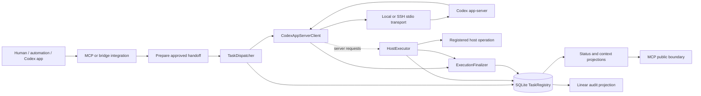
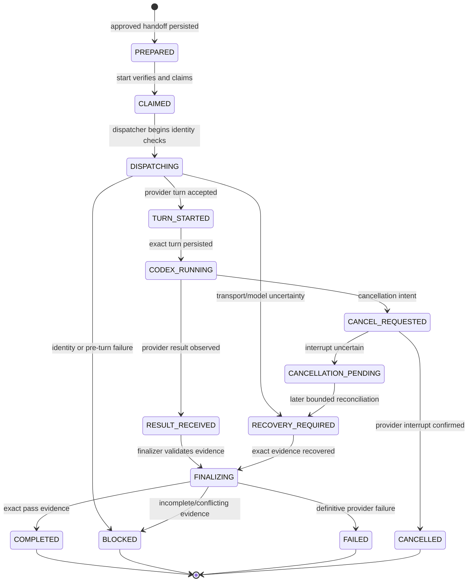
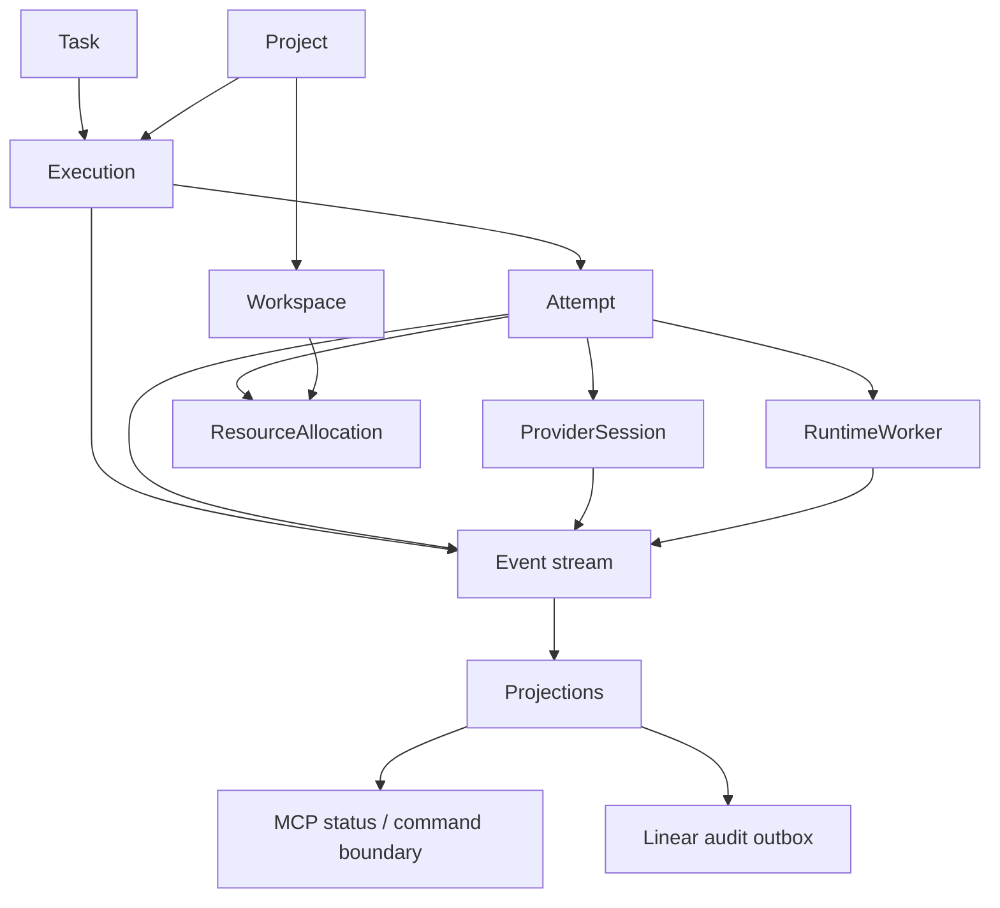
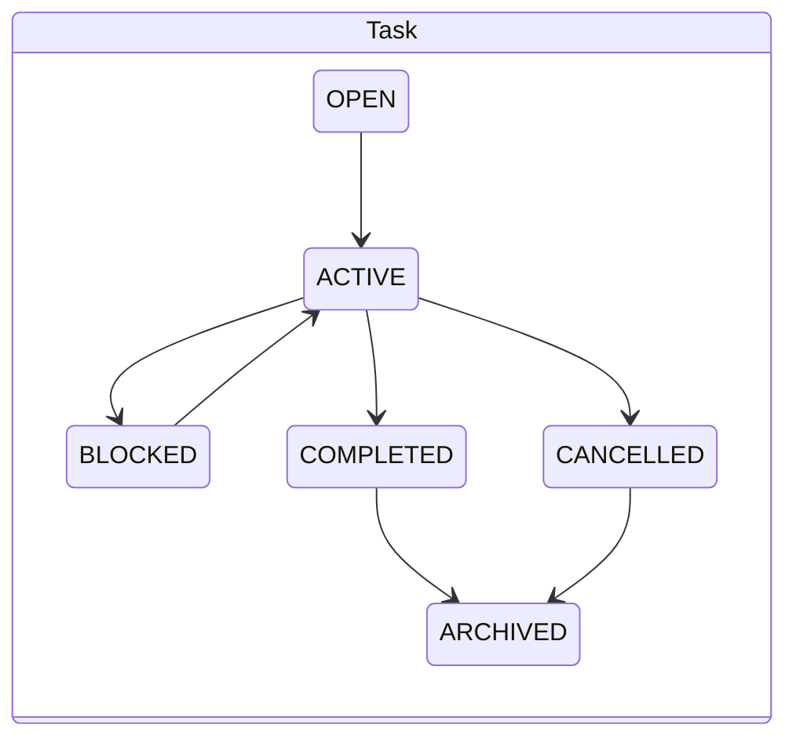
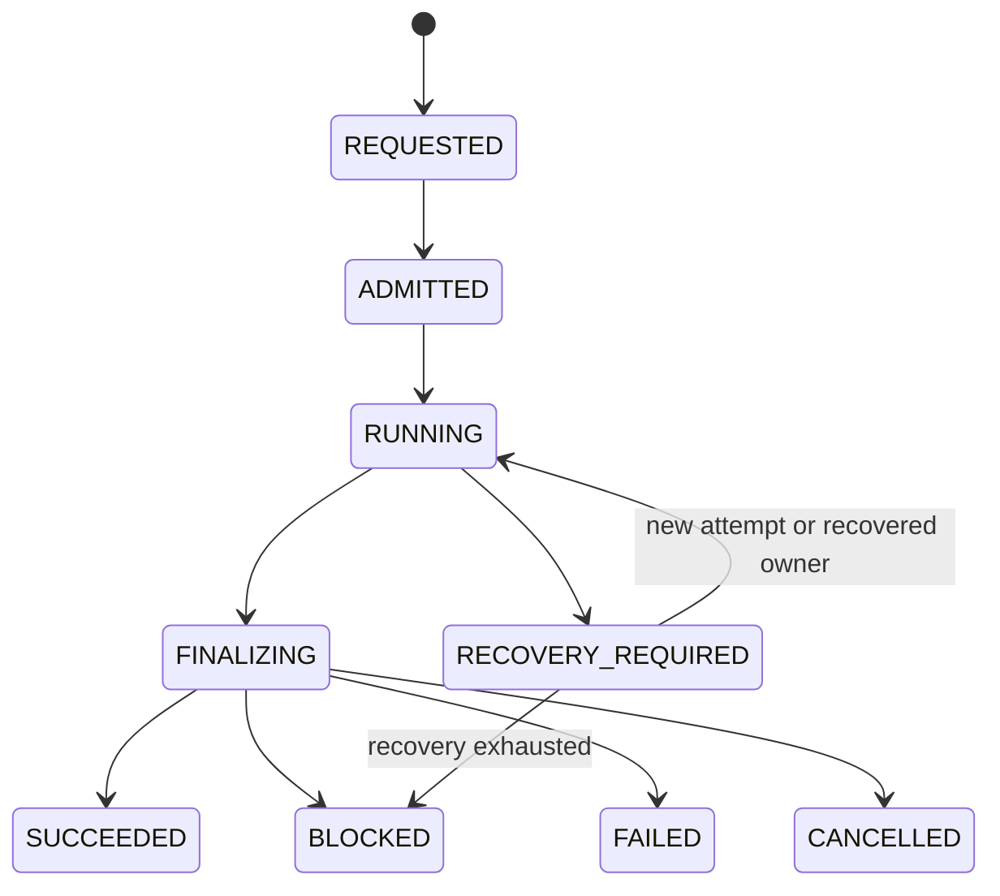
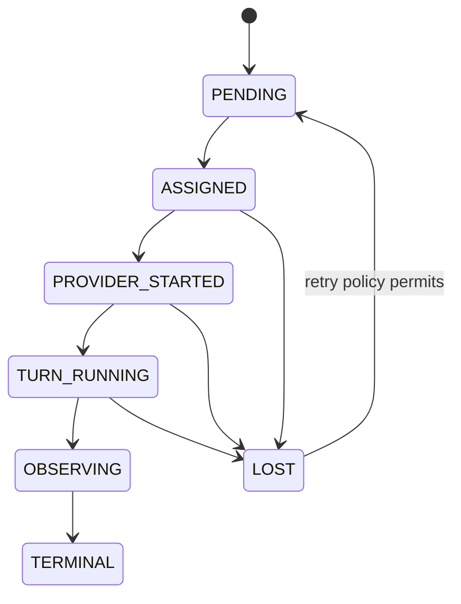

# CLINX V2 Architecture Review

**Review date:** 2026-09-10  
**Repository:** `/home/pvxlabs/dev/clinx`  
**Scope:** architecture discovery only. No production code was changed.

## Executive Summary

CLINX V1 is a local, standard-library Python control plane backed by SQLite. It already has a meaningful safety and audit model: durable task identity, exact provider thread/turn checks, immutable routing and policy snapshots, single-writer worktree leases, bounded host execution, strict result parsing, and a finalizer-owned terminal decision. Linear and MCP are deliberately downstream or bounded interfaces rather than execution authorities.

The central V2 constraint is structural rather than conceptual. V1 describes an execution as a bounded turn attached to a task, but the schema stores the active execution and current conversation as task-scoped singletons:

- `executions.task_id` is the primary key, so a task has at most one active execution.
- `conversation_bindings.task_id` is the primary key, so a task has one current provider conversation.
- `tasks` stores one current `turn_id` and one current execution projection.
- Provider events are drained synchronously and retained only in client memory.
- Recovery is initiated by startup or a status read; there is no durable worker/heartbeat/fencing model.

That is sufficient for a carefully bounded single-turn dispatcher. It is not sufficient for a control plane that must run multiple concurrent tasks, retry or fail over across attempts, support several providers, recover independently of a caller, and preserve deterministic causal history.

V2 should therefore preserve the V1 safety contracts while changing the unit of ownership. A `Task` remains long-lived user intent; an `Execution` becomes one requested run; an `Attempt` becomes one concrete provider/worker realization; `ProviderSession`, `RuntimeWorker`, and `ResourceAllocation` become first-class durable entities; and an append-only `Event` stream becomes the authoritative transition record. Current-state tables and MCP/Linear views become rebuildable `Projection`s.

## Review Method and Evidence

The review covered the implementation and tests for:

- `bridge.py`, including `TaskDispatcher`, project/thread resolution, dispatch, cancellation, reconciliation, context, and topic readers.
- `task_registry.py`, including SQLite schema, task/execution state, leases, prepared handoffs, result evidence, and audit records.
- `host_executor.py`, including capability validation, structured argv execution, cancellation, output capture, redaction, and host evidence.
- `execution_semantics.py` and `execution_policy.py`, including route identity, provider/transport separation, and authority policy.
- `app_server.py`, including local/SSH stdio transports, JSON-RPC handling, server requests, dynamic host tools, and turn supervision.
- `m9_integration.py`, including the finalizer, result service, status projection, MCP-facing handoffs, and Linear projection.
- `mcp_server.py`, including the public catalog, approval boundary, identity scrubbing, and stdio lifecycle.
- All checked-in test modules: `test_bridge.py`, `test_m5.py`, `test_m6.py`, `test_m7.py`, `test_m8.py`, `test_m9.py`, `test_m10.py`, `test_m11.py`, `test_m12.py`, `test_m13.py`, `test_m13b.py`, `test_m13c.py`, `test_runtime_wiring.py`, and `test_tunnel_child.py`.

Verification completed during this review:

```text
297 passed, 48 subtests passed in 5.10s
```

The passing suite proves the checked-in behavioral contracts. It does not prove distributed scheduling, long-running worker recovery, provider interoperability, or deployment-environment behavior.

## Current V1 Architecture

### System shape



The runtime is synchronous at the dispatch boundary. A dispatcher claims a task and worktree, establishes or verifies a provider conversation, starts one turn, and either supervises the turn or later reconciles it. SQLite makes claims and selected state transitions durable, but there is no independent scheduler that assigns work to durable workers.

### Durable schema shape

The primary schema is defined in [`task_registry.py:489`](</home/pvxlabs/dev/clinx/task_registry.py:489>). The important V1 relationships are:

```text
tasks (one durable task projection)
  ├── conversation_bindings (one current task -> provider thread/session)
  ├── conversation_binding_lineage (one migration record)
  ├── conversation_adoptions (one historical adoption record)
  ├── executions (one active execution row per task)
  │     └── worktree_leases (one mutable lease per canonical worktree)
  ├── execution_history (released opaque executions)
  ├── execution_results (one result per execution_ref)
  ├── host_executions (many host evidence rows per execution)
  ├── context_checkpoints / context_anchors
  ├── prepared_executions (approval and integrity-sealed handoff)
  ├── task_indexes / linear_executions
  └── linear_audit_events (idempotent downstream projection state)
```

SQLite uses WAL mode, foreign keys, a 30-second busy timeout, and `BEGIN IMMEDIATE` for selected claim/preparation paths. There is no general append-only event table, no versioned event stream, and no durable worker heartbeat table.

### Current domain model

| Domain concept | V1 representation | Current authority and limitation |
|---|---|---|
| **Task** | `tasks` row with `task_id`, project/workspace/cwd metadata, coarse status, execution state, route and policy JSON, current `turn_id`, blocker/failure fields | Created by `TaskRegistry.create_task`, normally through dispatcher/integration. It is the durable engineering identity. It is a mutable projection, not an event-sourced aggregate. |
| **Execution** | `executions` active row, optional opaque `execution_ref`, plus `execution_history` after release | Intended to represent one bounded provider turn and its lease/evidence. `executions.task_id PRIMARY KEY` limits a task to one active execution. History is retained for opaque executions but is not a full transition log. |
| **Thread / provider session / turn** | `conversation_bindings` stores one current `thread_id` and `session_id`; `tasks.turn_id` stores one current turn | Current provider is Codex app-server. Thread migration has explicit predecessor/successor lineage. Provider session is not a first-class entity and multiple sessions per execution are not modeled. |
| **Provider** | `ProviderIdentity` and `CodexAppServerClient` | Semantic types are generic, implementation is Codex-specific. Provider methods, status names, result parsing, transport assumptions, and dynamic tool behavior are spread through dispatcher, registry, integration, and tests. |
| **Host** | `WorkspaceRegistry`, routing identity, registered host targets, and `HostExecutor` | A host/workspace is a configured execution target. Host operations are bounded by policy, capability, project registration, route identity, and worktree lease. Host worker ownership is process-local. |
| **Result** | Strict `CLINX_EXECUTION_RESULT` parser, `execution_results`, host evidence, and finalizer decision | `ExecutionFinalizer` combines provider outcome, exact result marker, and host evidence. Terminal states include `COMPLETED`, `BLOCKED`, `FAILED`, `CANCELLED`, and `RECOVERY_REQUIRED`. |
| **Lease** | `worktree_leases` keyed by canonical host/cwd/repository origin | Claimed transactionally with an execution. Released by terminal reconciliation or context-manager cleanup. Reclaim is conservative and evidence-based. There is no epoch/fencing token or renewable owner lease. |
| **Recovery** | Task flags, retained execution history, checkpoints, bounded provider reads, startup reconciliation, and status-triggered self-healing | Recovery is a procedural path rather than a durable workflow. It requires a caller to invoke reconciliation and has legacy null-reference compatibility paths. |

### State ownership

#### Creation and admission

1. `ClinxIntegration.prepare_execution` validates the request, resolves policy/model layers, and persists an integrity-sealed `prepared_executions` row. Preparation does not dispatch.
2. `start_execution` verifies the prepared reference and literal approval, marks it running, and calls the dispatcher.
3. `TaskDispatcher.dispatch` creates a task for a new task action or loads an existing task for continuation.
4. `TaskRegistry.execution(...)` claims the task-scoped active execution and canonical worktree lease in a `BEGIN IMMEDIATE` transaction. See [`task_registry.py:2901`](</home/pvxlabs/dev/clinx/task_registry.py:2901>).

The registry owns durable admission, but there is no separate scheduler or global capacity decision. A task and worktree are the main admission keys.

#### Mutation during execution

- `TaskDispatcher` advances the task projection through `CLAIMED`, `DISPATCHING`, `TURN_STARTED`, and `CODEX_RUNNING`, and persists the exact turn when known.
- `CodexAppServerClient` owns the live provider transport, request IDs, notification draining, and in-memory event list. It observes provider state but does not persist a provider event log.
- `HostExecutor` validates and runs structured operations, tracks child processes in `_active`, and writes `host_executions` evidence through the registry.
- `TaskRegistry.set_execution_state` mutates the task projection and mirrors the stage into the active execution row.
- Cancellation persists intent first, then attempts provider interruption and host cancellation.

#### Finalization and release

`ExecutionFinalizer` is the intended terminal decision authority. It validates exact task/execution/turn ownership, parses the result, evaluates host evidence, writes `execution_results`, transitions the task, releases the mutable worktree lease, and then attempts Linear projection. The tested order is result persistence -> terminal state -> lease release -> downstream projection. Linear failure cannot revoke the local terminal decision.

The registry also has explicit cancellation, terminal reconciliation, orphaned/null-reference reconciliation, release, and context-manager cleanup paths. These paths are necessary compatibility and recovery behavior, but they increase the number of procedural routes that must remain mutually consistent.

#### Status projection

- `tasks` is the local coarse and execution-state projection.
- `ClinxIntegration.get_status` exposes task state, exact execution state when available, result evidence, host evidence, route/policy projections, and Linear audit status.
- Status reads can trigger one bounded provider reconciliation and stale-lease reclamation.
- `TaskContextReader` and `TopicStatusReader` provide bounded context and topic projections; they do not start provider turns.
- `mcp_server.py` exposes a deliberately bounded public catalog. Private thread/session/turn/cwd/execution identity is scrubbed from public results.
- Linear is an idempotent audit/notification projection and is not allowed to gate or overwrite CLINX terminal truth.

### V1 lifecycle



This state machine is represented primarily by mutable columns in `tasks`, `executions`, `execution_history`, and `execution_results`. The state names are durable; the causal sequence that produced them is not.

## Architectural Risks and Limitations

### 1. Concurrency and admission

V1 supports independent tasks on different worktrees, and tests prove that a second owner of the same worktree is rejected. It does not provide a scheduler with global capacity, fairness, priority, backpressure, quotas, or retry budgets. SQLite serializes selected claims on one database file, but that is not a distributed execution policy.

The host executor also maintains active subprocesses in process memory. A second CLINX process can inspect persisted host rows, but cannot take ownership of a live in-memory process through a durable worker protocol.

### 2. Multiple executions, attempts, and speculative work

The task-scoped primary key on `executions` prevents concurrent executions for one task. That is safe for V1's single-writer assumption but blocks V2 requirements such as:

- parallel provider attempts;
- retry attempts with independent provider correlations;
- provider failover while preserving the same execution;
- approval or review attempts that overlap with coding work;
- hedged execution with one winner and explicit loser cancellation.

`execution_history` is historical retention, not an active execution aggregate. The task projection also has only one current turn and one current stage, so a late event from one attempt must be handled procedurally and defensively.

### 3. Recovery reliability

Recovery is bounded and intentionally conservative, but it is caller-driven. A status read or process startup may reclaim a terminal stale lease or perform one provider read. There is no durable recovery queue, retry schedule, heartbeat, owner epoch, fencing token, or independent reconciler that guarantees progress when the original dispatcher disappears.

The implementation distinguishes transport uncertainty, provider failure, cancellation pending, and exact terminal evidence. That distinction is correct, but the absence of a durable event stream means recovery must infer history from current rows and retained execution records. Legacy executions with `NULL` `execution_ref` require separate orphan paths and cannot be attributed with the same confidence as modern executions.

### 4. Provider abstraction

`ProviderIdentity` is a useful boundary, but the concrete architecture remains Codex-shaped:

- provider thread/session/turn names are embedded in storage and public contracts;
- `CodexAppServerClient` owns custom WebSocket-over-stdio framing and JSON-RPC details;
- provider status normalization is implemented in dispatcher code;
- result extraction assumes Codex message shapes and CLINX markers;
- dynamic host tool registration is attached to one client instance and one live turn;
- there is no adapter contract for submit, observe, interrupt, resume, capability discovery, event cursor, or idempotency.

Adding a second provider today would require touching the dispatcher, reconciliation logic, persistence assumptions, context readers, result parser, and tests rather than implementing one isolated adapter.

### 5. Persistence and causal history

The registry is a strong durable state store for a single-node service, but it is not a canonical history:

- there is no append-only domain event log;
- `updated_at` and `last_progress_at` do not establish causal ordering;
- route and policy JSON snapshots are auditable inputs but not versioned aggregate records;
- provider notifications are not persisted with event IDs or sequence numbers;
- external projection state is tracked for Linear, but there is no general outbox/inbox model;
- migration logic is incremental schema repair rather than a named, versioned migration stream.

As a result, replay, audit reconstruction, multi-process ownership, and deterministic recovery are harder than the current row layout suggests.

### 6. Event ordering and crash windows

The finalizer imposes a good intended order, but crashes can still occur between provider observation, result persistence, task transition, lease release, and Linear writeback. Idempotent reads and exact identity guards reduce the risk, but they do not replace a durable event sequence. Provider events held in `CodexAppServerClient.events` can be lost when the process exits, and dynamic-tool supervision can lose the in-memory handler on restart.

### 7. Scaling limits

The synchronous dispatcher/client model, one live provider connection per operation, SQLite single-file coordination, and external synchronous Linear calls are appropriate for local dogfood. They are not a natural foundation for horizontally scaled workers, high task volume, multi-region state, or long-running operations whose initiating process is disposable.

## CLINX V2 Target Architecture

### Design goals

V2 should provide:

1. Durable lifecycle progress independent of the initiating process.
2. Many executions and attempts per task, with explicit concurrency policy.
3. Provider-neutral core contracts and provider-specific adapters.
4. Event-ordered, idempotent state transitions and replayable projections.
5. Renewable resource ownership with fencing against stale workers.
6. Bounded, evidence-first host operations retained as immutable evidence.
7. Compatibility with the current opaque public MCP boundary and Linear audit role.

### Target entities and ownership

| Entity | Ownership | Purpose and invariant |
|---|---|---|
| **Project** | Project/catalog service | Stable engineering repository/domain identity, default policy, allowed providers, and project-level concurrency defaults. It does not own a live run. |
| **Workspace** | Workspace/resource service | Concrete host, worktree, runtime namespace, and capacity scope. It owns canonical resource identity and allocation rules, not task intent. |
| **Task** | Task aggregate | Long-lived user intent and human lifecycle. It may have many executions and provider sessions. It must not store a provider-specific current turn as its source of truth. |
| **Execution** | Execution aggregate | One requested run of a task. Owns request snapshot, deadline, execution policy, route constraints, admission state, terminal outcome, and winner/loser policy for attempts. |
| **Attempt** | Execution aggregate / worker coordinator | One concrete realization of an execution on one worker/provider. Owns retry number, provider correlation, assignment, heartbeat, evidence references, and attempt outcome. Multiple attempts may exist, but only the execution policy decides whether they may overlap. |
| **ProviderSession** | Provider adapter service | Durable provider-specific session/thread identity, capability snapshot, provider version, lifecycle, and correlation metadata. A task or execution may have multiple sessions, including migration successors. |
| **RuntimeWorker** | Worker registry/scheduler | Durable worker identity, capabilities, host binding, heartbeat, assignment lease, and fencing epoch. It is the only actor allowed to mutate a live attempt while holding the current assignment fence. |
| **Event** | Event store | Immutable fact with event ID, aggregate ID/type, aggregate version, timestamp, actor, causation/correlation IDs, idempotency key, and payload schema version. It is the authoritative transition history. |
| **ResourceAllocation** | Resource coordinator | Lease/fence for a worktree, host slot, provider capacity, or other constrained resource. It records owner attempt, epoch, expiry/renewal, and release reason. |
| **Projection** | Projection workers/read model service | Rebuildable task status, execution status, operator view, MCP view, Linear audit outbox, metrics, and search indexes. Projections never become command authority. |

### Target relationship diagram



The core command path should be `Task -> Execution -> Attempt`, not `Task -> current thread -> current turn`. Provider sessions and host allocations are attached to attempts and can be replaced without changing task identity.

### State machines







Supporting lifecycles:

- `ProviderSession`: `DISCOVERED -> BOUND -> ACTIVE -> PAUSED/UNAVAILABLE -> CLOSED`.
- `RuntimeWorker`: `REGISTERED -> HEALTHY -> DRAINING -> OFFLINE`; assignments are fenced by worker epoch.
- `ResourceAllocation`: `REQUESTED -> HELD -> ACTIVE -> RELEASE_PENDING -> RELEASED`.
- `Projection`: `PENDING -> APPLIED`, with durable retry/degraded status.

Every transition is emitted as an event. A command may reject an invalid transition, but it must not silently mutate a projection without recording the fact that caused it.

### State ownership rules

#### Command service

The command service creates `Task` and `Execution`, validates immutable request snapshots, and emits `ExecutionRequested` or `ExecutionCancelled`. It does not directly own provider sockets or host child processes.

#### Scheduler/resource coordinator

The scheduler admits executions, creates attempts, acquires `ResourceAllocation`s, and assigns attempts to a `RuntimeWorker`. It enforces per-project, per-workspace, per-provider, and global capacity. It may choose serial, parallel, retry, or failover behavior from the execution policy.

#### Runtime worker

The worker owns the live attempt while holding a renewable assignment lease and fencing epoch. It uses a provider adapter and host-operation adapter. On restart, another worker can recover the attempt only after the coordinator observes lease expiry and increments the epoch. A stale worker's writes are rejected by the fence.

#### Provider adapter

Each adapter implements a stable CLINX contract:

```text
discover_capabilities()
create_session()
resume_session(session_ref)
start_turn(session_ref, request)
observe(attempt_ref, cursor)
interrupt(attempt_ref)
close_session(session_ref)
normalize_event(provider_event)
```

The adapter owns provider protocol identity and maps it to CLINX correlation fields. The core never assumes that every provider has a thread/session/turn shape.

#### Finalizer

The finalizer consumes normalized attempt events and immutable host evidence. It decides the execution outcome according to an explicit evidence policy, emits one terminal execution event, and requests allocation release. It must be idempotent on `(execution_id, aggregate_version)` and reject late evidence from non-winning or fenced attempts unless the policy explicitly allows it.

#### Projection workers

Projection workers consume the event stream and update task status, operator views, MCP read models, Linear outbox state, metrics, and search indexes. A projection outage creates lag or degraded state; it cannot reopen, complete, or cancel an execution.

### Event envelope and ordering

Each event should include at least:

```json
{
  "event_id": "evt_...",
  "aggregate_type": "execution",
  "aggregate_id": "exec_...",
  "aggregate_version": 12,
  "event_type": "AttemptStarted",
  "occurred_at": "2026-09-10T00:00:00Z",
  "actor_type": "runtime_worker",
  "actor_id": "worker_...",
  "causation_id": "evt_...",
  "correlation_id": "request_...",
  "idempotency_key": "provider:...",
  "schema_version": 1,
  "payload": {}
}
```

Ordering rules:

1. An aggregate transition appends an event and updates its current-state row in one transaction.
2. A worker may append an attempt event only with the current assignment fence.
3. Provider notifications enter an inbox with provider event ID/cursor before normalization.
4. External projection work enters an outbox in the same transaction as the authoritative event.
5. Consumers deduplicate by event ID or idempotency key and advance a durable cursor.
6. Late events remain readable evidence but cannot mutate a newer aggregate version without an explicit recovery command.

### Storage model

Start with SQLite if the operational scope remains one node, but introduce the V2 contracts immediately:

```text
events
event_inbox
event_outbox
aggregate_versions
projects
workspaces
tasks
executions
attempts
provider_sessions
runtime_workers
resource_allocations
host_evidence
execution_results
projection_checkpoints
projection_failures
```

Current-state tables are optimized read models and may be rebuilt from events. Immutable evidence such as provider payload hashes, host stdout/stderr hashes, argv metadata, and result markers must be retained separately from projections. Secrets and private provider identifiers remain restricted to internal tables; MCP continues to expose opaque references and redacted route projections.

The event store should use aggregate-version optimistic concurrency for normal transitions and a unique idempotency key for retries. If V2 requires multiple processes or hosts, migrate the same event contract to Postgres plus a durable queue; do not make consumers depend on SQLite-specific locking behavior.

### Resource and lease model

V1's canonical worktree key remains useful, but V2 should make it a `ResourceAllocation` rather than an implicit side effect of `executions`:

- resource key: canonical host + workspace + cwd + repository origin;
- owner: attempt ID, worker ID, and allocation epoch;
- state: held/active/release-pending/released;
- expiry and renewal timestamps;
- release reason and evidence reference;
- optional capacity class for host/provider slots.

Mutating host operations must require the current allocation epoch. A stale worker must fail closed even if its process is still alive. Read-only operations may use separate capacity rules and need not hold the worktree writer allocation.

## Migration Strategy

The migration must preserve V1 behavior while introducing V2 records. Do not begin by deleting the task-scoped execution row or changing the public MCP contract.

### Phase 0: Freeze contracts and instrument

- Document the V1 state names, finalizer order, route immutability rules, public identity scrubbing, and Linear role.
- Add read-only instrumentation around claim, state transition, provider observation, host evidence, release, and projection timing.
- Keep `297 passed, 48 subtests passed` as the regression baseline.
- Define event schemas and correlation IDs before writing a new scheduler.

**Exit gate:** every V1 terminal path and recovery path can be traced by task, execution, turn, route, and result identity without changing behavior.

### Phase 1: Introduce V2 identifiers and event envelope

- Add stable `project_id`, `workspace_id`, `execution_id`, `attempt_id`, `provider_session_id`, `worker_id`, and `allocation_id` alongside V1 IDs.
- Add an append-only `events` table and aggregate version columns.
- Emit shadow events for existing registry mutations; V1 rows remain authoritative.
- Add an outbox for Linear audit updates and an inbox/dedup table for provider observations.

**Exit gate:** event replay reconstructs the V1 task/execution projection for fixtures and real read-only traces.

### Phase 2: Separate execution from attempts

- Create one V2 `Execution` for each V1 prepared/start request.
- Create one V2 `Attempt` for the current V1 provider turn.
- Keep the V1 `executions` row as a compatibility projection keyed to the active attempt.
- Move `turn_id` and provider correlation out of the task aggregate into attempt/session records.
- Record every provider thread migration as a new `ProviderSession` plus lineage events.

**Exit gate:** one task can have multiple retained executions and one execution can have multiple historical attempts without changing V1 public reads.

### Phase 3: Add worker ownership and allocation fencing

- Register the current dispatcher and host executor as `RuntimeWorker` instances.
- Move subprocess/provider ownership metadata from process memory into worker assignment records.
- Add heartbeat, expiry, assignment epoch, and takeover/recovery events.
- Make worktree and host capacity explicit `ResourceAllocation`s.
- Keep conservative V1 stale-reclaim rules until fencing is qualified.

**Exit gate:** kill and restart a worker in a test fixture; a replacement worker can recover an attempt exactly once, while stale writes are rejected.

### Phase 4: Introduce provider adapters and scheduler policies

- Extract a Codex adapter from `CodexAppServerClient` without changing its transport implementation.
- Define capability discovery, start/observe/interrupt/resume, cursor, and idempotency semantics.
- Add admission policies for serial, retry, failover, and bounded parallel attempts.
- Keep `ExecutionFinalizer` as the evidence policy boundary and normalize provider statuses before it.

**Exit gate:** a fake second provider and the Codex adapter pass the same core execution/attempt contract tests; provider-specific fields do not leak into core state transitions.

### Phase 5: Cut projections over to V2

- Build task, execution, attempt, operator, and MCP read models from events.
- Make `get_status` read projections plus explicitly requested reconciliation evidence.
- Make Linear a pure outbox consumer with durable retry and lag reporting.
- Preserve the current MCP prepare/start/cancel surface as a compatibility facade over V2 commands.

**Exit gate:** replay produces the same public status for a trace, projection restart is safe, and Linear outage does not affect command or terminal state.

### Phase 6: Retire V1 singleton assumptions

Only after replay, fencing, recovery, and provider qualification:

- remove the task primary-key assumption from active executions;
- make conversation bindings a compatibility view over provider sessions;
- retire null-reference orphan paths after the legacy population is drained;
- remove direct task `turn_id` authority;
- move SQLite locking assumptions behind the event-store interface;
- retain V1 public IDs as aliases until downstream clients migrate.

## Risks and Mitigations for V2

| Risk | Why it matters | Mitigation |
|---|---|---|
| Dual-write divergence | V1 row and V2 event can disagree during migration | Write event and V2 current state transactionally; initially keep V1 authoritative and run replay comparison. |
| Duplicate provider callbacks | Retries and reconnects can repeat terminal evidence | Provider inbox with provider event ID/cursor, idempotency keys, and exact attempt correlation. |
| Stale worker mutation | A paused worker may return after takeover | Renewable assignment plus monotonically increasing fencing epoch checked on every mutation. |
| Resource leak on crash | Provider socket or host process may outlive the initiating process | Worker heartbeat, allocation expiry, explicit recovery queue, and host-process reconciliation keyed to worker/attempt. |
| Incorrect parallel winner | Two attempts may both produce plausible results | Execution-level winner policy, compare evidence before terminal event, cancel losers, retain loser evidence. |
| Provider semantic mismatch | Different providers do not share Codex thread/turn behavior | Adapter contract with normalized events and capability negotiation; no provider fields in core transitions. |
| Projection lag mistaken for execution state | Operators may see stale MCP or Linear status | Include projection cursor/lag and authoritative event version in status; never accept projection input as command authority. |
| Event schema drift | Long-lived audit/replay breaks after code changes | Version event payloads, maintain upcasters, and qualify replay across representative historical fixtures. |
| SQLite ceiling | Single-file locking eventually limits workers and availability | Keep storage interface narrow; move to Postgres/queue when multi-node requirements are real, preserving event contracts. |
| Privacy leakage | More durable provider/host evidence increases exposure | Separate restricted evidence from public projections, hash/redact outputs, and retain opaque public IDs. |
| Migration complexity | V1 has legacy null-ref and task-scoped assumptions | Treat legacy paths as bounded compatibility adapters; measure and drain them before removal. |

## Recommended Decisions

1. Adopt `Execution` and `Attempt` as separate aggregates in V2.
2. Treat the append-only event stream as authoritative for transitions; treat current-state rows as projections.
3. Make worker assignment and resource allocation durable, renewable, and fenced.
4. Extract a provider adapter interface before adding a second provider.
5. Preserve the existing finalizer evidence policy and public MCP identity boundary.
6. Keep Linear downstream through an outbox; never make it an execution dependency.
7. Start V2 on SQLite only if the event-store and consumer interfaces are designed for a later Postgres/queue migration.
8. Do not claim V2 readiness until kill/restart recovery, late-event rejection, replay equivalence, concurrent attempts, and projection outage behavior are tested with runtime evidence.

## Conclusion

CLINX V1 is a disciplined single-node dispatcher with unusually strong identity and evidence safeguards. Its safety boundaries are worth carrying forward. The architectural work for V2 is to move those safeguards from procedural, task-scoped state into durable aggregate ownership, event ordering, worker fencing, and rebuildable projections. The migration can be incremental, but the singleton assumptions in `executions`, `conversation_bindings`, and `tasks.turn_id` should be treated as the primary blockers to the AI Engineering Control Plane described in the objective.
